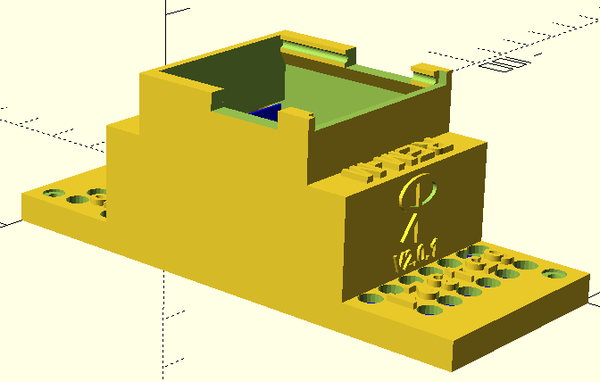

# REM
Rainers Energy Measurement

This project ist in german, to translate you can use a translator program like https://translate.google.com/translate?hl=de&sl=auto&tl=en&u=https%3A%2F%2Fgithub.com%2FRrPt%2FREM

Das Projekt REM erlaubt es die Leistung von vielen Kanälen gleichzeitig zu messen.
Die Komponenten werden normalerweise in der Hausverteilung installiert.

