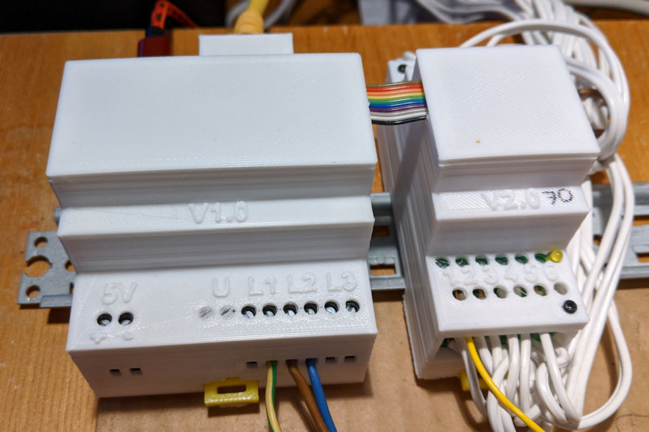
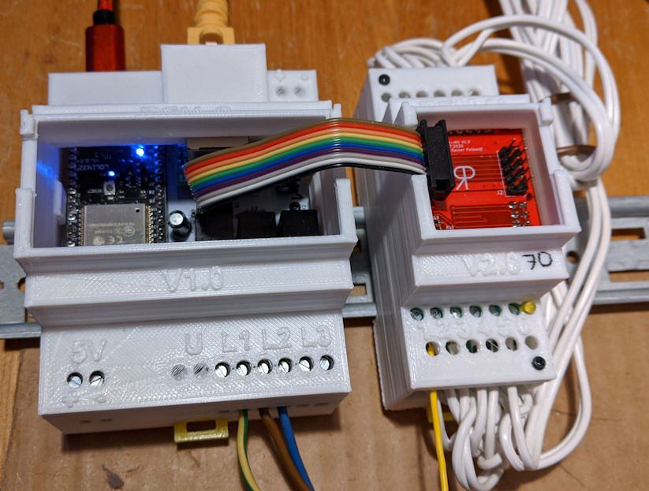

# REM
Rainers Energy Measurement

**Short englisch description:**  
*REM is an AC Energy Monitor based on the Analog Devices IC ADE7816 and a 
ESP32 microcontroller. It consists of one controlling module REM-C and one
to eight measuring modules REM-M, where each REM-M modul can measure up to 
12 different circuits. So totaly 96 circuits can be meassured.
Power data can be sent by MQTT or WebServer. The Webserver ist also used for configuration and calibration.*

*This project ist in german, to translate you can use a translator program like [here](https://translate.google.com/translate?hl=de&sl=auto&tl=en&u=https%3A%2F%2Fgithub.com%2FRrPt%2FREM)*

**Kurzbeschreibung:**  
REM ist ein Energiemonitor der auf dem Analog Device IC ADE7816 und einem Mikrocontroller ESP32 basiert.
Er besteht aus einem Kontrollermodul REM-C und einem bis acht Messmodulen REM-M. 
Jedes REM-M Modul kann 12 verschiedene Leistungskreise messen, so dass insgesamt bis zu 
96 Schaltkreise gemessen werden können.
Die Leistungsdaten können per MQTT versendet oder über einen Webserver abgefragt werden.
Der Webserver wird auch für die Konfiguration und die Kalibrierung verwendet.

Die Komponenten werden normalerweise in der Hausverteilung installiert und können dann die Leistung von z.B. einzelnen Zimmern erfassen.

Wine ausführliche Beschreibung ist im [Wiki](wiki/Home) zu finden.
## Übersicht
Das System besteht aus mehreren Hutschinenkomponenten, die über den REM-Bus miteinander verbunden sind

## [REM-C](https://github.com/RrPt/REM/wiki/REM-C) 
Das REM-C Modul enthält den Controller. Dieser fragt alle Messwerte über den 
REM-Bus von den einzelnen REM-M Modulen ab und stellt diesen über den 
Ethernetanschluß zur Verfügung. Die geschieht per MQTT und einen Webserver.
Über den Webserver erfolgt auch die Kalibrierung.

An das REM-C Modul werden auch die drei Phasen der Spannungssignale angeschlossen,
diese werden galvanisch getrennt und über den REM-Bus den einzelnen REM-M Modulen
 zur Verfügung gestellt.

Es können bis zu 8 REM-M Module mit je 12 Kanälen angeschlossen werden, 
insgesamt also bis zu 96 Kanäle.

Für die Platine des REM-C Moduls stehen die KICAD Pläne, 
die 3D-Modelle der Gehäuse (SCAD) und 
die Controllersoftware in C++ (Arduino) zur Verfügung. 

## [REM-M](https://github.com/RrPt/REM/wiki/REM-M) 
### [REM-MH](https://github.com/RrPt/REM/wiki/REM-MH) 
Das REM-M Modul beinhaltet zum einen ein Verteilermodul REM-MH, 
welches den REM-BUS auf die 2 REM-MM Module aufteilt.
Auf diesem wird auch per Jumper die Adresse des REM-M Moduls eingestellt.
### [REM-MM](https://github.com/RrPt/REM/wiki/REM-MM) 
Jedes REM-M Modul beinhaltet 2 REM-MM Platinen, die für die eigentliche 
Messung zuständig sind.
An jede REM-MM Platine können 6 Stromsensoren angeschlossen werden, 
zusammen mit der über den REM-Bus gelieferten Spannung 
(Phase über Jumper für alle 6 Sensoren gleich einstellbar)
können so für alle 6 Kanäle die folgenden Energieparameter bestimmt werden:
 * Strom RMS
 * Leistung
 * Blindleistung
 
Pro REM-MM Platine:
 * Spannung RMS
 * Frequenz

Für die Platinen des REM-M Moduls stehen die KICAD Pläne und 
die 3D-Modelle der Gehäuse (SCAD) zur Verfügung. 

## Status
Das Projekt ist noch in der Entwicklung (Stand September 2020), 
allerdings sind sowohl Platinen als auch Gehäuse fertig.
In Entwicklung ist noch die Software und die Dokumentation.

## Bilder

## Stichwörter
 * ADE7816, Energy Metering IC
 * ESP32
 * TCA9548A
 * USR ES1
 * Leistungsmessung, Blindleistungsmessung, Spannungsmessung, Strommessung, RMS
 * Stromwandler, Current transformer, ZMPT107-1, CT1005
 * Energiemonitor
 
